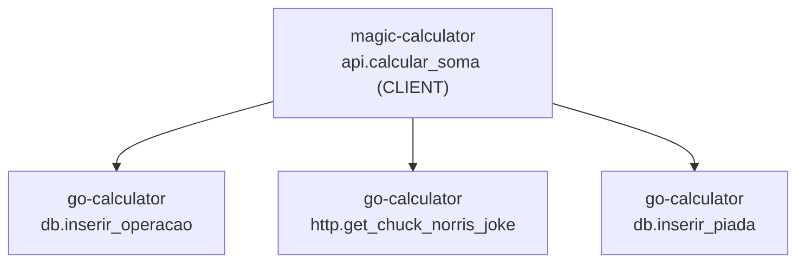

# aws-terraform-eks

Repositório que contém exemplo de código em terraform para a criação de um cluster EKS.


## Para executar Manualmente

Login na conta lab da forceone para realização dos testes

```bash
# Conta Forceone LAB

. assumeRoleAwsCli.sh RoleAcessoF1-Lab 825976399165 xxxxxx

aws eks --region us-west-2 update-kubeconfig --name eks-demo-open-telemetry
```
Criar com o terraform:

```bash
make fmt
make validate
make plan
```

Par destruir

```bash
make destroy-plan
make destroy

# Caso precise remover algum objeto do state
terraform state list | grep -E 'helm_release'

terraform state rm 'helm_release.signoz'
terraform state rm 'module.eks_blueprints_addons.module.metrics_server.helm_release.this[0]'

```


## Outros rascunhos


```bash
helm repo add signoz https://charts.signoz.io

helm repo update


wander@aspire:~$ helm repo list
NAME           	URL                                                       
insightsoftware	https://repo-logisymphony.insightsoftware.com/helm-charts/
eks            	https://aws.github.io/eks-charts                          
signoz         	https://charts.signoz.io  


helm search repo signoz


wander@aspire:~$ helm search repo signoz
NAME                      	CHART VERSION	APP VERSION	DESCRIPTION                                       
signoz/signoz             	0.115.0      	v0.115.0   	SigNoz Observability Platform Helm Chart          
signoz/signoz-otel-gateway	0.0.4        	v0.0.16    	A Helm chart for deploying SigNoz Opentelemetry...
signoz/alertmanager       	0.5.2        	0.5.0      	The Alertmanager handles alerts for SigNoz.       
signoz/clickhouse         	24.1.18      	24.1.2     	A Helm chart for ClickHouse                       
signoz/k8s-infra          	0.15.0       	0.139.0    	Helm chart for collecting metrics and logs in K8s 
signoz/postgresql         	0.0.2        	15.0.0     	A Helm Chart for PostgreSQL                       
signoz/zookeeper          	0.0.1        	3.8.1      	Bitnami Helm chart for Zookeeper                  
wander@aspire:~$


helm pull signoz/signoz

tar -xvzf signoz-0.115.0.tgz


```

https://docs.aws.amazon.com/pt_br/eks/latest/userguide/auto-configure-alb.html


```bash

# Iniciar o POD utilizando a imagem do ubuntu 24.04
kubectl run ubuntu-test -it --rm --image=ubuntu:24.04 -- /bin/bash

# Atualizar o repositório e os pacotes 24.04 e instalar ferramentas essenciais
apt update && apt upgrade -y && apt install -y curl dnsutils iputils-ping telnet net-tools netcat-openbsd gnupg2 wget lsb-release mysql-client


# Teste API calculadora
curl -X POST http://calculadora-api.calculator.svc.cluster.local/backend \
  -H "Content-Type: application/json" \
  -d '{"nome": "Wander", "operador1": 10, "operador2": 32}'

# Teste API calculadora (erro)
curl -X POST http://calculadora-api.calculator.svc.cluster.local/backend \
  -H "Content-Type: application/json" \
  -d '{"nome": "Wm", "operador1": 10, "operador2": 32}'

# Teste joke-factor
curl http://joke-factor.calculator.svc.cluster.local/joke


# Conectar no mysql
mysql -h mysql-lab.wandermaia.com -u admin_user -P 3306 -p
# SenhaSegura123!

# show databases;
# use mydb;
# show tables;
# select * from operacoes;
# select * from piadas;

```

Erro no signoz por falta de recursos:

```bash

# Exemplo de comando para aumentar o limite (ajuste conforme o nome do seu statefulset) Ajustado no terraform.
kubectl set resources statefulset chi-signoz-clickhouse-cluster-0-0 -n signoz --limits=memory=4Gi --requests=memory=2Gi


kubectl rollout restart statefulset chi-signoz-clickhouse-cluster-0-0 -n signoz
kubectl rollout restart deployment signoz-otel-collector -n signoz


```

## Upload das imagens dos containers


```bash

unset ACCOUNT_AWS
echo ${ACCOUNT_AWS}

export ACCOUNT_AWS=$(aws sts get-caller-identity --query "Account" --output text)

echo ${ACCOUNT_AWS}

# 1. Autenticar o Docker na AWS
aws ecr get-login-password --region us-east-1 | docker login --username AWS --password-stdin ${ACCOUNT_AWS}.dkr.ecr.us-east-1.amazonaws.com

# 2. Build e Tag do Backend
cd src
docker build -t calculadora-backend ./go-calculator
docker tag calculadora-backend:latest ${ACCOUNT_AWS}.dkr.ecr.us-east-1.amazonaws.com/calculadora-backend:latest
docker push ${ACCOUNT_AWS}.dkr.ecr.us-east-1.amazonaws.com/calculadora-backend:latest


# 3. Build e Tag do Frontend
docker build -t calculadora-frontend ./magic-calculator
docker tag calculadora-frontend:latest ${ACCOUNT_AWS}.dkr.ecr.us-east-1.amazonaws.com/calculadora-frontend:latest
docker push ${ACCOUNT_AWS}.dkr.ecr.us-east-1.amazonaws.com/calculadora-frontend:latest


docker push ${ACCOUNT_AWS}.dkr.ecr.us-east-1.amazonaws.com/calculadora-backend:latest
docker push ${ACCOUNT_AWS}.dkr.ecr.us-east-1.amazonaws.com/calculadora-frontend:latest

```


