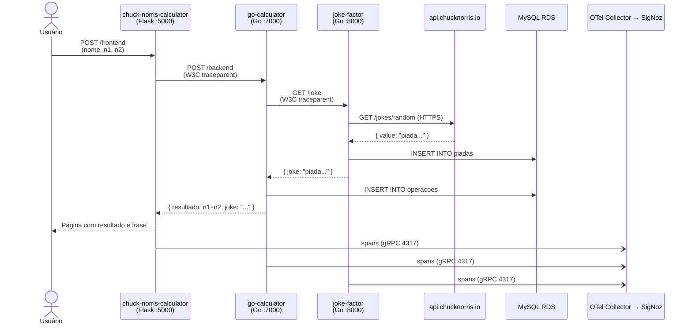
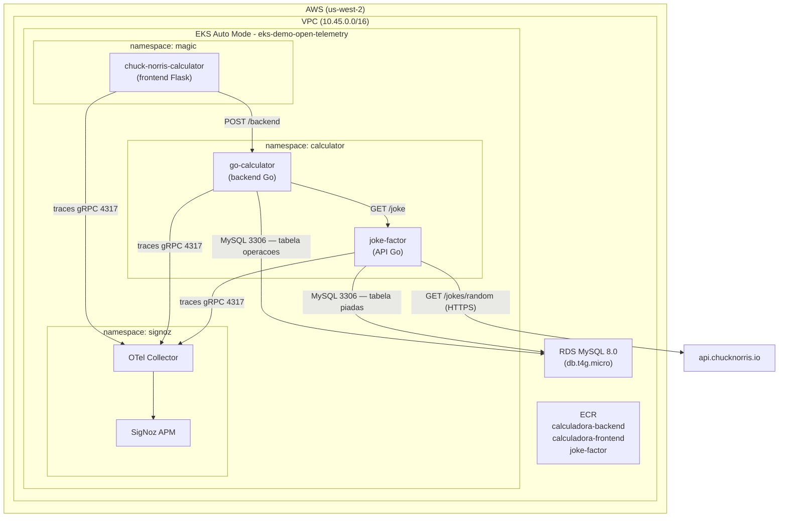
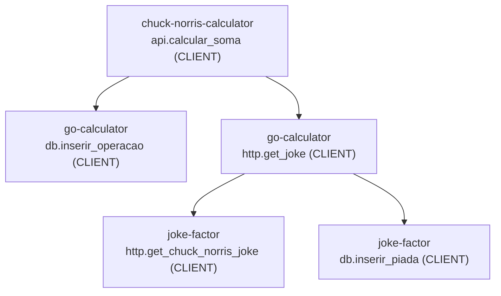

# aws-terraform-eks-otel-demo

Demo de observabilidade com OpenTelemetry e SigNoz rodando em Amazon EKS. O projeto provisiona toda a infraestrutura via Terraform e faz o deploy de três aplicações de exemplo que se comunicam entre si e enviam traces distribuídos para o SigNoz APM.

## A aplicação de demonstração

A demo simula uma calculadora com personalidade: o usuário informa seu nome e dois inteiros e recebe o resultado da soma acompanhado de uma frase aleatória do Chuck Norris. Por baixo desse fluxo simples, três serviços se comunicam em cadeia, cada um instrumentado com OpenTelemetry, gerando um trace distribuído completo visível no SigNoz.

### Fluxo de uma requisição



A propagação de contexto usa o header HTTP **W3C TraceContext** (`traceparent`) em todas as chamadas entre serviços, garantindo que todos os spans de uma requisição compartilhem o mesmo `trace_id`.

### O que está instrumentado

| Serviço (`service.name`) | Span | Kind | O que mede |
|---|---|---|---|
| `chuck-norris-calculator` | `api.calcular_soma` | CLIENT | Chamada HTTP POST ao go-calculator |
| `go-calculator` | `http.get_joke` | CLIENT | Chamada HTTP GET ao joke-factor |
| `go-calculator` | `db.inserir_operacao` | CLIENT | INSERT na tabela `operacoes` do MySQL |
| `joke-factor` | `http.get_chuck_norris_joke` | CLIENT | Chamada HTTPS à API pública do Chuck Norris |
| `joke-factor` | `db.inserir_piada` | CLIENT | INSERT na tabela `piadas` do MySQL |

Cada span carrega atributos de contexto (nome do usuário, operandos, resultado) e o `trace_id` propaga pela cadeia inteira, permitindo visualizar a requisição de ponta a ponta no SigNoz como um único trace com cinco spans aninhados.

### Timeouts configurados

| Camada | Timeout | Detalhe |
|---|---|---|
| `magic-calculator` → `go-calculator` | 10 s | `requests.post(..., timeout=10)` |
| `go-calculator` → MySQL (`db.inserir_operacao`) | 5 s | `context.WithTimeout` no `db.ExecContext` |
| `joke-factor` → `api.chucknorris.io` | 3 s | `http.Client{Timeout: 3s}` dedicado |

## Visão geral da arquitetura



## Trace distribuído

Cada requisição gera um trace completo visível no Jaeger/SigNoz com a seguinte hierarquia de spans:



A propagação usa W3C TraceContext (`traceparent`) em todas as chamadas HTTP entre serviços.

## Estrutura do repositório

```
.
├── infra/                              # Terraform — provisionamento da infraestrutura
│   ├── env/
│   │   └── lab/
│   │       ├── backend.hcl             # Configuração do backend S3
│   │       ├── terraform.tfvars        # Variáveis do ambiente lab
│   │       └── K8s-Infra-value.yaml    # Values do chart k8s-infra (OTel)
│   ├── modules/
│   │   └── rds/                        # Módulo local — RDS MySQL + Security Group
│   │       ├── main.tf
│   │       ├── variables.tf
│   │       └── outputs.tf
│   ├── Makefile                        # Atalhos para comandos Terraform
│   ├── destroy_config.json             # Controla destroy vs apply nas pipelines
│   └── *.tf                            # Recursos Terraform raiz
│
└── src/                                # Aplicações de exemplo
    ├── docker-compose.yml              # Sobe todo o stack localmente
    ├── otel-collector-config.yaml      # Config do OTel Collector (compose)
    ├── go-calculator/                  # Backend — API Go (porta 7000)
    │   ├── k8s/manifesto.yaml
    │   └── Dockerfile
    ├── joke-factor/                    # API de piadas — Go (porta 8000)
    │   ├── k8s/manifesto.yaml
    │   └── Dockerfile
    └── magic-calculator/               # Frontend — Flask Python (porta 5000)
        ├── k8s/manifesto.yaml
        ├── img/chuck.png
        └── Dockerfile
```

## Infraestrutura (Terraform)

| Recurso | Descrição |
|---|---|
| VPC | CIDR `10.45.0.0/16`, 2 AZs, subnets pública/privada/database |
| NAT Gateway | Single NAT Gateway |
| EKS Auto Mode | Cluster `eks-demo-open-telemetry`, versão 1.35 |
| Karpenter NodePool | Instâncias `t/c/m/r`, `medium` a `4xlarge`, spot + on-demand |
| SigNoz | Instalado via Helm no namespace `signoz` |
| OTel Collector | Chart `k8s-infra` do SigNoz, coleta métricas do cluster |
| RDS MySQL 8.0 | `db.t4g.micro`, nas subnets de database — provisionado via módulo local `modules/rds` |
| ECR | `calculadora-backend`, `calculadora-frontend`, `joke-factor` |
| ACM | Certificado auto-assinado para HTTPS no ALB do SigNoz e do frontend |
| StorageClass | `sc-ebs-gp3-encrypted` como padrão do cluster |
| IngressClass | `alb-internal` (padrão) e `alb-external` |

### Comandos Terraform (via Makefile)

```bash
make init ENV=lab       # Inicializar
make ci-validate        # Validar sem backend
make plan ENV=lab       # Planejar
make apply ENV=lab      # Aplicar
make destroy-plan ENV=lab
make destroy ENV=lab
```

### Controle de destroy nas pipelines

O arquivo `infra/destroy_config.json` controla o comportamento da pipeline de infra:

```json
{
    "lab": false,   // false = provisionar | true = destruir
    "prd": false
}
```

## Aplicações

### chuck-norris-calculator (frontend)

Interface web em Python/Flask. O usuário informa seu nome e dois números inteiros; o resultado da soma é exibido acompanhado de uma frase do Chuck Norris.

- **Porta:** 5000
- **Namespace K8s:** `magic`
- **ECR:** `calculadora-frontend`
- **Endpoint de health:** `GET /frontend`
- **Variável de ambiente:** `API_URL` aponta para o go-calculator via service interno do K8s
- **Ingress:** ALB externo com HTTPS (redirect HTTP→443), `ingressClassName: alb-external`

### go-calculator (backend)

API REST em Go que realiza a soma dos operandos, grava o histórico em MySQL e consulta o joke-factor para obter a piada antes de responder.

- **Porta:** 7000
- **Namespace K8s:** `calculator`
- **ECR:** `calculadora-backend`
- **Endpoint de health:** `GET /backend`
- **Variáveis de ambiente:** `DB_*` para o MySQL, `JOKE_FACTOR_URL` para o joke-factor

### joke-factor (API de piadas)

API REST em Go que busca uma piada aleatória em `api.chucknorris.io`, persiste os dados (id, created_at, value) na tabela `piadas` do MySQL e retorna o texto da piada.

- **Porta:** 8000
- **Namespace K8s:** `calculator`
- **ECR:** `joke-factor` *(repo a criar)*
- **Endpoint de health:** `GET /health`
- **Endpoint principal:** `GET /joke`
- **Variáveis de ambiente:** `DB_*` para o MySQL, `OTEL_EXPORTER_OTLP_ENDPOINT`

## Banco de dados

Um único MySQL compartilhado pelos dois serviços Go:

| Tabela | Serviço | Colunas |
|---|---|---|
| `operacoes` | go-calculator | id, nome, operador1, operador2, data_execucao |
| `piadas` | joke-factor | id (PK), created_at, value |

## Pipelines CI/CD (GitHub Actions)

### Infra

| Workflow | Trigger | Ambiente |
|---|---|---|
| `infra-lab.yml` | Push em `develop` com path `infra/**` ou manual | lab (us-west-2) |
| `infra-prd.yml` | Manual (`workflow_dispatch`) | prd (us-east-1) |

O workflow reutilizável `terraform.yml` executa dois jobs em sequência:
1. **validate** — `make ci-validate` (sem credenciais AWS)
2. **deploy** — `make plan` + `make apply` ou `make destroy-plan` + `make destroy`

### Aplicações

| Workflow | Trigger | Ambiente |
|---|---|---|
| `api-lab-calculadora-api.yml` | Push em `lab` com path `src/go-calculator/**` ou manual | lab |
| `api-prd-calculadora-api.yml` | Push em `main` com path `src/go-calculator/**` ou manual | prd |
| `front-lab-magic-calculator.yml` | Push em `lab` com path `src/magic-calculator/**` ou manual | lab |
| `front-prd-magic-calculator.yml` | Push em `main` com path `src/magic-calculator/**` ou manual | prd |

> **Pendente:** criar workflows para o `joke-factor` (lab e prd) e o ECR repo correspondente.

O workflow reutilizável `ci-cd.yml` executa dois jobs em sequência:
1. **CI** — build da imagem Docker e push para o ECR
2. **CD** — substituição dos placeholders nos manifestos e deploy no EKS via `kubectl apply`

### Secrets necessários no GitHub

| Secret | Descrição |
|---|---|
| `AWS_ACCESS_KEY_ID` | Chave de acesso AWS |
| `AWS_SECRET_ACCESS_KEY` | Chave secreta AWS |
| `DB_USER` | Usuário do banco de dados |
| `DB_PASSWORD` | Senha do banco de dados |
| `DB_HOST` | Endpoint do RDS MySQL |
| `CERTIFICATE_ARN` | ARN do certificado ACM (output do Terraform) — usado no Ingress do frontend |
| `DOCKERHUB_USERNAME` | Usuário do Docker Hub (evita rate limit de pull anônimo) |
| `DOCKERHUB_TOKEN` | Access Token do Docker Hub (gerado em Account Settings → Security) |

## Como executar localmente

```bash
cd src
docker compose up --build
```

Serviços disponíveis após o boot:

| Serviço | URL |
|---|---|
| Frontend | http://localhost:5000/frontend |
| go-calculator API | http://localhost:7000/backend |
| joke-factor API | http://localhost:8000/joke |
| Jaeger UI (traces) | http://localhost:16686 |
| Métricas go-calculator | http://localhost:7000/metrics |
| Métricas joke-factor | http://localhost:8000/metrics |

## Observabilidade

O SigNoz é acessível via ALB externo após o provisionamento. O OTel Collector coleta:
- Traces das três aplicações via gRPC (`signoz-otel-collector.signoz.svc.cluster.local:4317`)
- Métricas de infraestrutura do cluster EKS (nodes, pods, deployments)
- Logs do cluster

## Referências

### OpenTelemetry

- [W3C TraceContext — especificação do header `traceparent`](https://www.w3.org/TR/trace-context/)
- [OpenTelemetry SDK Go](https://opentelemetry.io/docs/languages/go/)
- [OpenTelemetry SDK Python](https://opentelemetry.io/docs/languages/python/)
- [OpenTelemetry Semantic Conventions](https://opentelemetry.io/docs/specs/semconv/)

### SigNoz

- [Instalação do SigNoz no Kubernetes (Helm)](https://signoz.io/docs/install/kubernetes/)
- [k8s-infra chart - coleta de métricas e logs do cluster](https://signoz.io/docs/tutorial/kubernetes-infra-metrics/)
- [Kubernetes Dashboards](https://signoz.io/docs/dashboards/dashboard-templates/kubernetes-dashboards/)

### AWS / EKS

- [EKS Auto Mode](https://docs.aws.amazon.com/eks/latest/userguide/automode.html)
- [EKS Blueprints Addons (Terraform)](https://aws-ia.github.io/terraform-aws-eks-blueprints-addons/)
- [Karpenter — NodePool e EC2NodeClass](https://karpenter.sh/docs/)
- [AWS Load Balancer Controller](https://kubernetes-sigs.github.io/aws-load-balancer-controller/)

### Terraform

- [Terraform AWS Provider](https://registry.terraform.io/providers/hashicorp/aws/latest/docs)
- [Módulo terraform-aws-eks](https://registry.terraform.io/modules/terraform-aws-modules/eks/aws/latest)
- [Módulo terraform-aws-vpc](https://registry.terraform.io/modules/terraform-aws-modules/vpc/aws/latest)
- [Módulo terraform-aws-rds](https://registry.terraform.io/modules/terraform-aws-modules/rds/aws/latest)

### APIs e bibliotecas

- [Chuck Norris API](https://api.chucknorris.io/)
- [go-chi/chi - router HTTP para Go](https://github.com/go-chi/chi)
- [Flask — framework web Python](https://flask.palletsprojects.com/)
